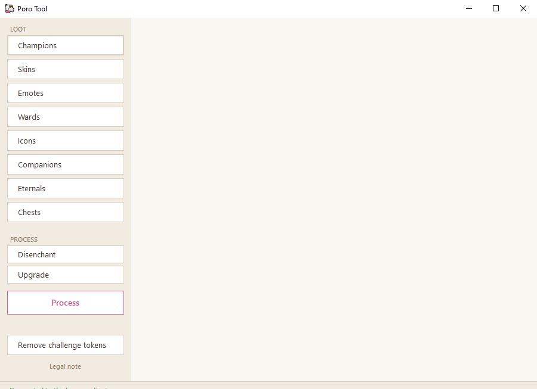

# Poro Tool

A small desktop utility for League of Legends that does the boring loot work for you:

- **Bulk disenchant / upgrade** champion shards, skin shards, emotes, ward skins, icons and eternals — no client animations, no clicking one shard at a time.
- **Forge companions and emotes** in batches.
- **Open chests and capsules** with a chosen recipe, repeated as many times as you want.
- **Remove challenge tokens** from your profile banner (the client no longer lets you clear them).

Poro Tool talks to the official local League Client API (LCU) — the same one the client itself uses. It doesn't touch the game, doesn't read memory and doesn't automate gameplay.



## Usage

1. Start the League client and log in.
2. Run `PoroTool.exe` — the status bar at the bottom shows when it connects.
3. Pick a loot category, adjust the amounts, choose *Disenchant* / *Upgrade* / *Forge* and hit **Process**.

If it doesn't connect, give it a few seconds after logging in. Running Poro Tool as administrator can help on some setups.

## Building

Requires the [.NET SDK](https://dotnet.microsoft.com/download) (any recent version — the app itself targets .NET Framework 4.8, which ships with Windows 10/11, so end users don't need to install anything):

```
dotnet build PoroTool.sln
```

The output lands in `PoroTool/bin/Debug/net48/`.

## Legal

Poro Tool isn't endorsed by Riot Games and doesn't reflect the views or opinions of Riot Games or anyone officially involved in producing or managing League of Legends. League of Legends and Riot Games are trademarks or registered trademarks of Riot Games, Inc. League of Legends © Riot Games, Inc.
